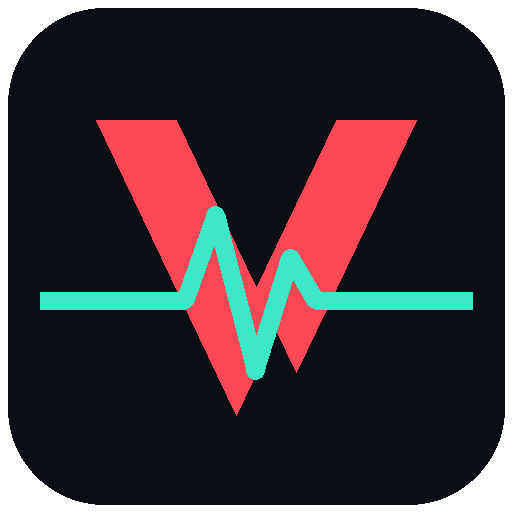

# VALO PULSE

### Le tracker Valorant nouvelle génération — stats détaillées & Coach IA, directement dans ton navigateur

---

## 🎯 C'est quoi Valo Pulse ?

**Valo Pulse** analyse ton compte Valorant en un clic, directement depuis ton navigateur, et te donne tout ce qu'il faut pour progresser : des **statistiques détaillées** colorées selon ton niveau et un **Coach IA** qui lit tes vrais matchs.

> Connexion **Discord**, tracker **gratuit**, interface sombre gaming. **Rien à télécharger, rien à installer** — tout se passe sur [valopulse.tech](https://valopulse.tech).

---

## ✨ Fonctionnalités

### 📊 Tracker complet — *Gratuit*
- **Pulse Score** /1000 avec tier coloré (S / A / B / C / D)
- Rang, RR, peak, winrate, **ACS, ADR, K/D, HS%** — chaque stat **colorée** selon ton niveau (vert = bien, rouge = à travailler)
- **K/D par arme** avec les visuels officiels (Vandal, Phantom, Sheriff…)
- **14 badges** à débloquer, liés à ton compte
- Historique des matchs détaillé
- **Carte de profil** stylée à partager sur Discord & Twitter

### 🤖 Coach IA — *Premium*
- Une IA lit tes **10 derniers matchs** et compare tes stats à un niveau **S-Tier**
- Diagnostic chiffré de tes points forts et faibles
- Conseils concrets et personnalisés — *pas de blabla générique*

### ⚡ Optimisation PC — *Premium*
- **Diagnostic performance** de ta machine
- Détection des applications gourmandes
- Conseils personnalisés pour **gagner des FPS** et baisser ton ping

---

## 🚀 Comment commencer ?

1. **Rends-toi sur [valopulse.tech](https://valopulse.tech)**
2. Connecte-toi avec **Discord**
3. Entre ton **Riot ID** (pseudo#TAG)
4. Analyse ton profil ! 🎯

> **Compatible :** Chrome, Firefox, Edge, Safari — PC, mobile & tablette. Aucun téléchargement requis.

---

## 💎 Premium

Le tracker est **100 % gratuit**. Le Premium débloque le Coach IA et l'Optimisation PC, et fait tourner le serveur.

| Formule | Prix | Inclus |
|:---|:---:|:---|
| 💎 **Mois** | 12,99 € | Coach IA **+** Optimisation PC |

👉 Activation via le **[Discord](https://discord.gg/vpulse)**.

---

## 🔗 Liens

### 🌐 [valopulse.tech](https://valopulse.tech) &nbsp;•&nbsp; 💬 [discord.gg/vpulse](https://discord.gg/vpulse)

---

Créé avec ❤️ par **fvnz**

Valo Pulse n'est pas approuvé par Riot Games et ne reflète pas les opinions ou positions de Riot Games. Valorant et Riot Games sont des marques déposées de Riot Games, Inc.

